# Astra

<p align='center'>
    
</p>

Astra es un E-commerce que comercializa productos de tecnologia y bioseguridad. Fue desarrollado en cojunto con un gran grupo de trabajo y asesorado por un equipo de profesionales como <a href="https://soyhenry.com/" rel="nofollow">Soy Henry.</a>

## Homepage

<p align='center'>
    
</p>

## Login y register

## Register

Registrase es muy facil !!. Lo puedes hacer con cualquier correo electronico o si lo prefieres hazlo con tu cuenta de Gmail. Solo debes llenar el fomulario y aceptar los terminos. Listo, Bienvenido a Astra.

<p align='center'>
    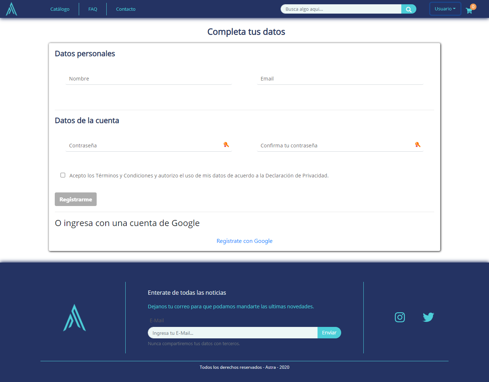
</p>

### Login

Luego de registrate, ahora ya puedes loegarte con tu cuenta y empezar a disfrutar de los servicios de Astra.

<p align='center'>
    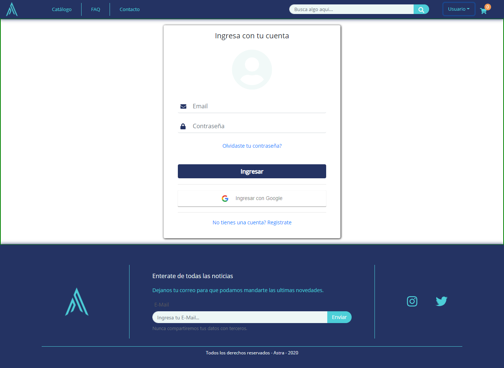
</p>

## Catálogo

Luego de logearte, puedes ahora disfrutar de los servicios de Astra. Uno de ellos es ver nuestro catalago. Para eso, debes dirigirte a la pestaña CATALOGO en la parte superior, aca podras ver todos nuestros productos, podras filtrarlos por categrias o nombres.

<p align='center'>
    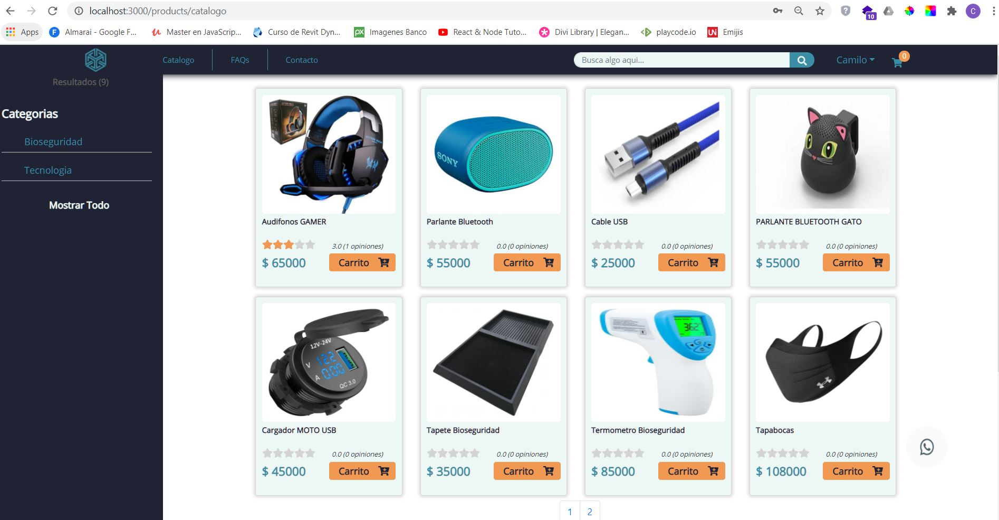
</p>
 
 
## Detalle del producto

Puedes ver el detalle del producto, ac podras encontrar la informacion necesaria para qeu decidas si añadirloal carrito o comprar directamente.

<p align='center'>
    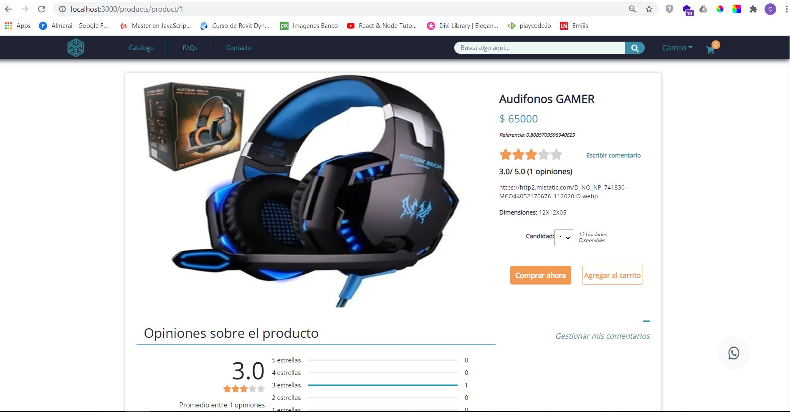
</p>
 
 
## Carrito de Compras

Como cualquier E-commerce, tambien podras tener tu carrito de compras, aca almacenaras todos los productos que quieres comprar. De igual menera tendras la posiilidad de cambiar las cantidades de cada producto o eliminarlos si lo prefieres.

<p align='center'>
    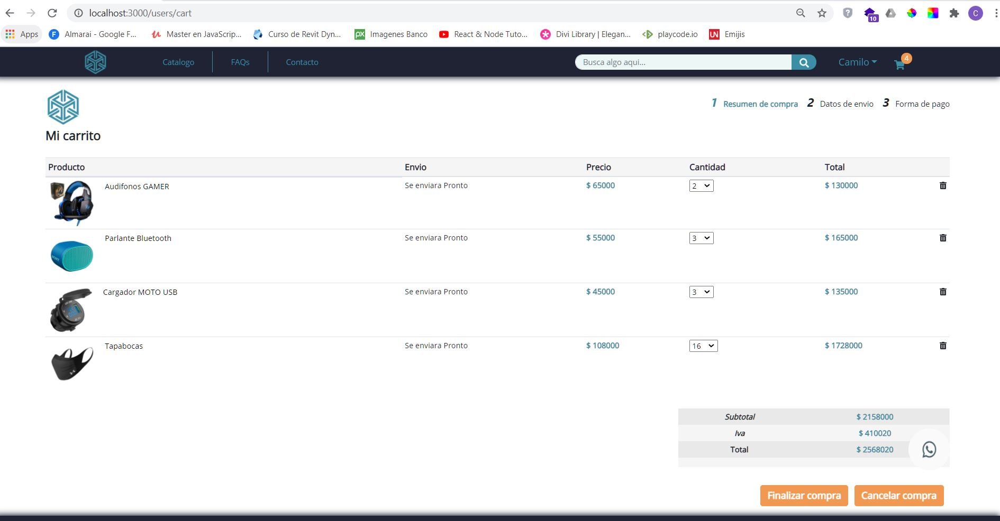
</p>
 
## Proceso de Checkout y Pago

Una vez tengas los productos que quieres comprar en tu carrito, ya podras continuar con el proceso final de compra. Para esto, debes completar dos pasos mas. El primero sera un formulario en el que te pediremos los datos de envio para almacenar en la orden el lugar al cual debemos enviarte los productos. El segundo sera el proceso de pago, aca te brindamos la posibilidad de realizar tu pago por medio de una tarjeta de credito o debito (libreria Stripe), solo tendras que digitar la siguiente informaciion:

### Datos de envio:

<p align='center'>
    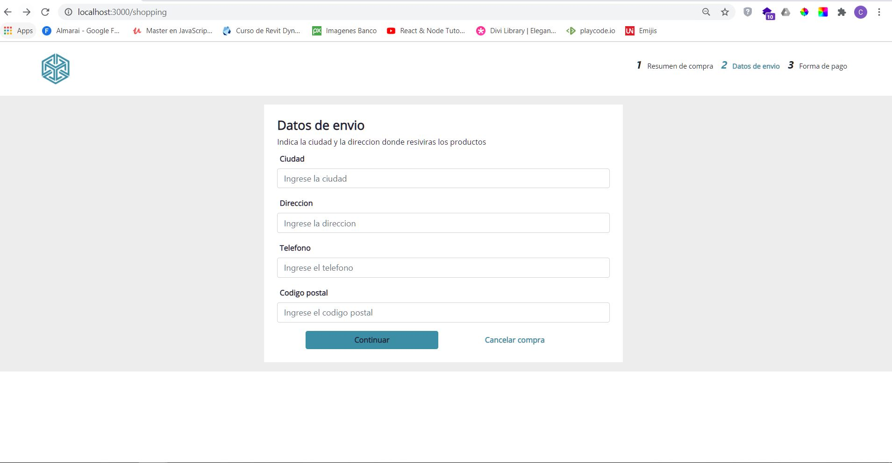
</p>

### Pago:

Si deseas probar esta función, podes usar la siguiente información:

- Número: 4242 4242 4242 4242</li>
- Fecha: 04/24</li>
- FCVV: 242</li>
- Ultimos digitos: 42424</li>

<p align='center'>
    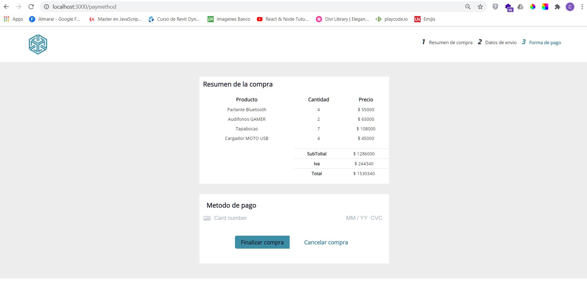
</p>
 
 
## Compra finalizada

Te enviaremos un correo electronico con la confirmacion de la compra y el resumen de tus productos.

<p align='center'>
    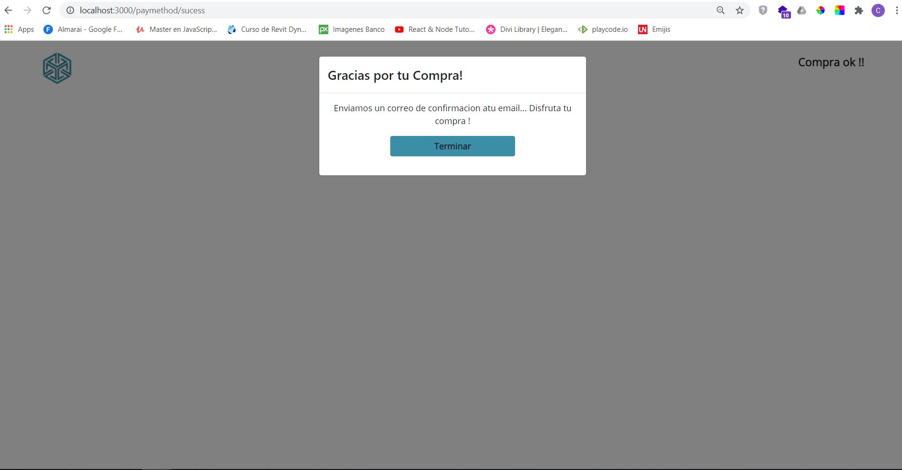
</p>
<p align='center'>
    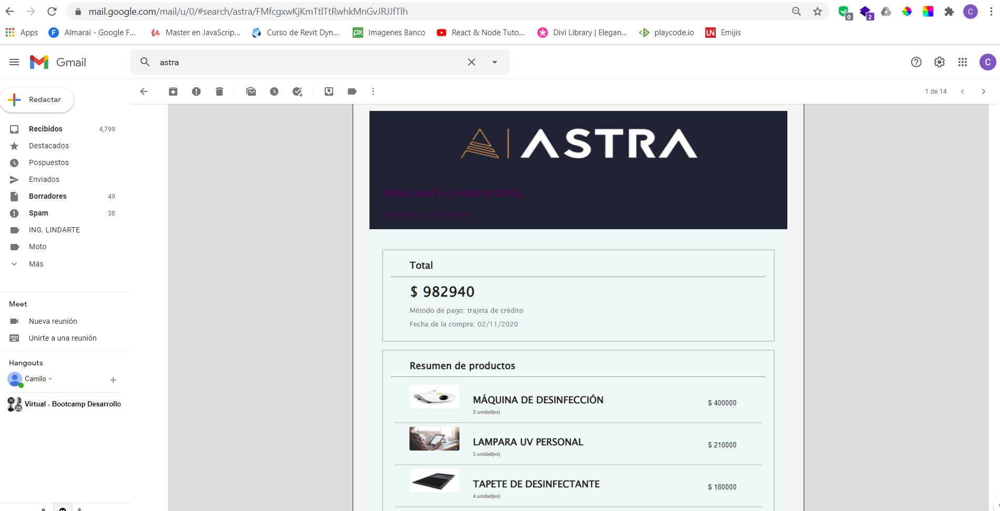
</p>

## Administrador

Para agregar productos, categorias, administrar ordenes y useuarios, tienes que ser Administrador. Para esto, debes regsitrar un usuarios como ADMIN. Esto lo hacemos con POSTMAN.

<p align='center'>
    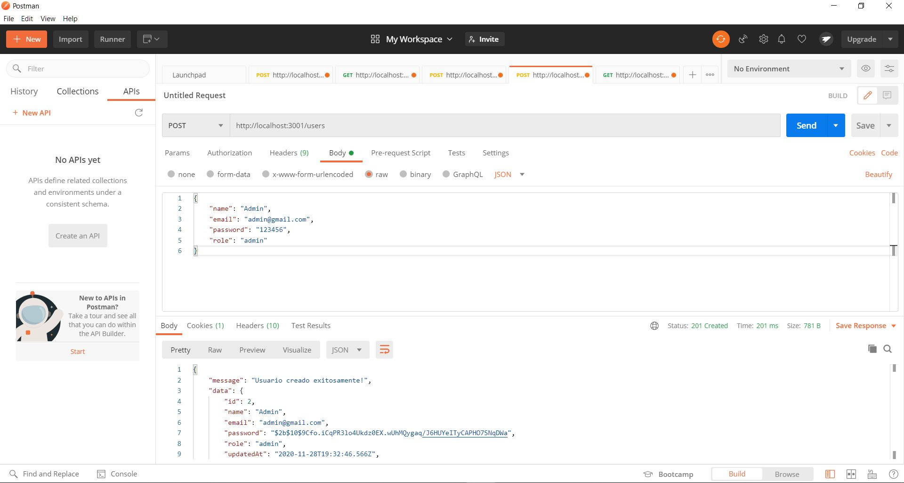
</p>

Luego de esto ya puedes logearte como administrador. Con este Rol tendras acceso a todas las funciones de un usuario comun y las funciones de administratrar todas la categorias y productos principalmente.

### Home del Administrador

<p align='center'>
    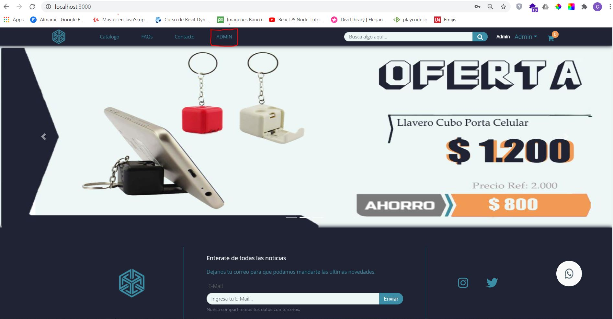
</p>

### Agregar Categorias

<p align='center'>
    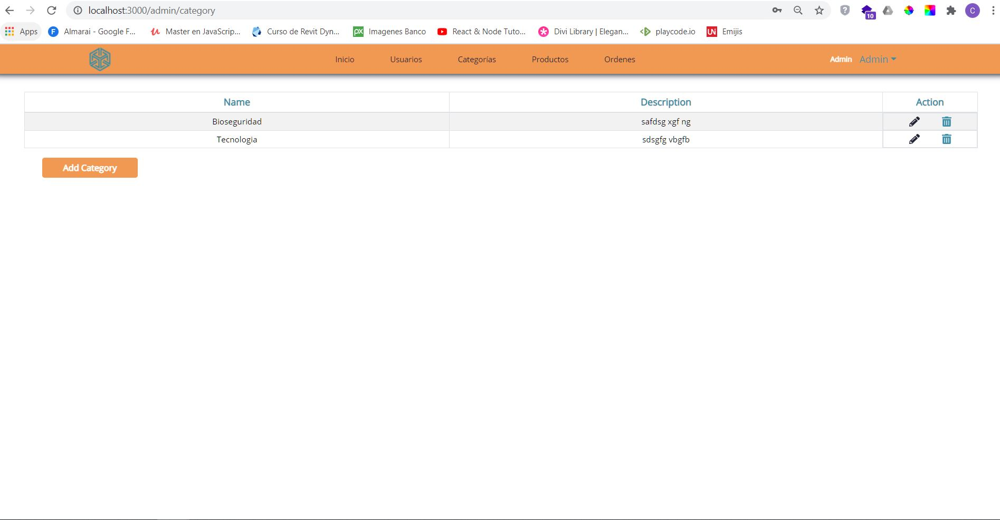
</p>

### Agregar Productos

<p align='center'>
    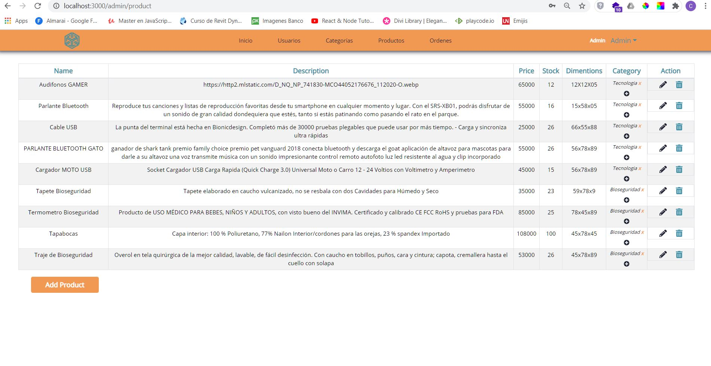
</p>

## Como correr el proyecyo?

- Crea una cuenta en Mailgun
- Buscar la Private Key y el dominio del email. Más abajo hay un ejemplo de como deberían ser
- Crea una base de datos en PostgreSQL. En este ejemplo le pondremos "development". Se crea con el siguiente comando: CREATE DATABASE development
- Crea un archivo dentro de la carpeta "api" llamado .env con el siguiente contenido:

```js
DB_USER = usuariopostgres;
DB_PASSWORD = TuContraseña12345;
DB_HOST = localhost;
MAILGUN_API_KEY = privatekeydemailgun;
MAILGUN_DOMAIN = sandbox(seriedenumerosyletras).mailgun.org;
```

- Posicionate en la carpeta api y ejecuta el comando npm install
- Posicionate en la carpeta client y ejecuta el comando npm install
- Correr los servers
- Abrí dos consolas
- En una consola posicionate en la carpeta api y ejecuta el comando npm start
- En la otra consola, posicionate en la carpeta client y ejecuta el comando npm start

## Tecnologias usadas

### Frontend

- React hooks
- Redux
- react Bootstrap

### Backend

- Nodejs
- Express JS
- Sequelize (PostgreSQL)
- Mailgun
- Passport
